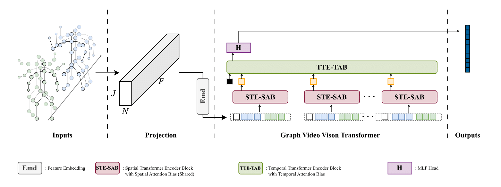
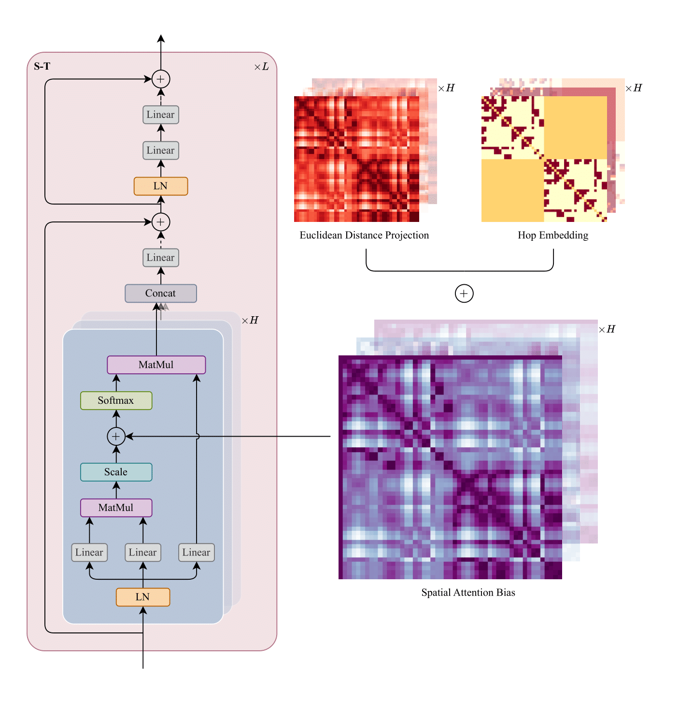
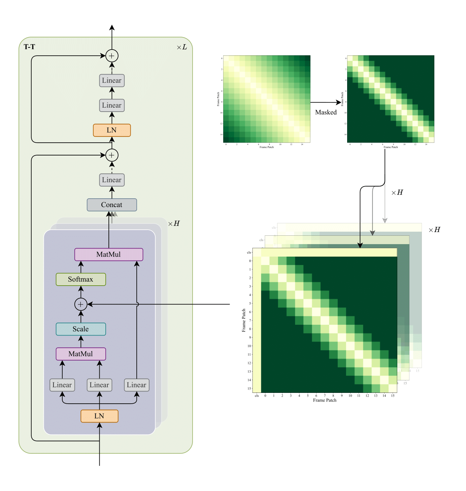

# Graph-ViViT

This is the **EIE590 Dissertation Project** focusing on **Deep Neural Networks for Skeleton-based Human Action Recognition**.

Graph-ViViT is a graph-based video vision transformer for action recognition. It is based on the [ViViT](https://arxiv.org/abs/2103.15691) architecture and uses pure Transformer blocks to process joint only skeleton data.

## Overview



|  |  |
|----------------------|----------------------|

## Results

| Method                                          | X-Sub 60 | X-View 60 | X-Sub 120 | X-Set 120 |
| ----------------------------------------------- | -------- | --------- | --------- | --------- |
| [ST-GCN](https://arxiv.org/abs/1801.07455)      | 81.5     | 88.3      | -         | -         |
| [1s-AGCN](https://arxiv.org/abs/1805.07694)     | 86.0     | 93.7      | -         |           |
| [SkelViT](https://arxiv.org/abs/2311.08094)     | 73.44    | 80.85     | -         | -         |
| [ST-TR](https://arxiv.org/abs/2008.07404)       | 89.2     | 95.8      | 82.7      | 85.0      |
| [Skateformer](https://arxiv.org/abs/2403.09508) | 93.5     | 97.8      | 89.8      | 91.4      |
| GraphViViT (ours)                               | 87.23    | 92.60     | 82.79     | 85.03     |

Our model achieves significant improvements over pure Transformer-based method (SkelViT) and performs comparable to models from two or three years ago. Compared to SOTA, there is still a gap of around 6%.

## Run

### Train from Scratch

```bash
python train.py --config config.json
```

### Resume

```bash
python train.py --resume path/to/checkpoint
```

### Test

```bash
python test.py --resume path/to/checkpoint
```

### Vis

```bash
tensorboard --logdir saved/log/
```

### Data Preparation

#### Directory Structure

Unzip NTU-RGB+D 60 and 120 skeleton datasets to the following directory structure:

```text
- data
  - ntu/
  - ntu120/
  - nturgbd_raw/
    - nturgbd_skeletons/      # from `nturgbd_skeletons_s001_to_s017.zip`
    - nturgb+d_skeletons120/  # from `nturgbd_skeletons_s018_to_s032.zip`
```

- Run the following command:

```bash
cd ./data/ntu # or cd ./data/ntu120
# Get skeleton of each performer
python get_raw_skes_data.py
# Remove the bad skeleton 
python get_raw_denoised_data.py
# Transform the skeleton to the center of the first frame
python seq_transformation.py
```
